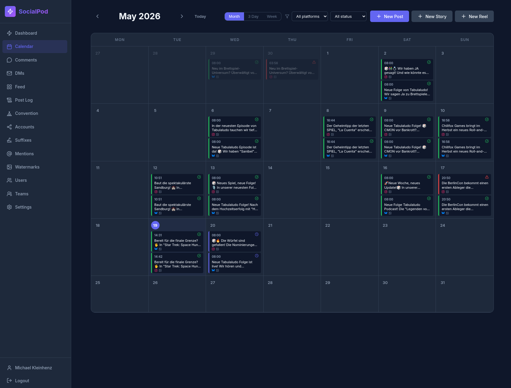
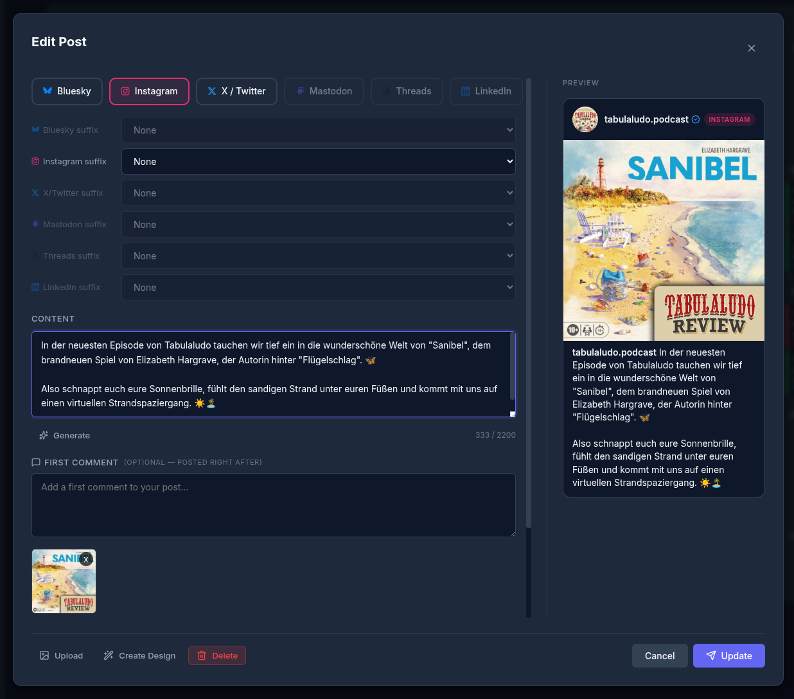

# SocialPod — Social Media Scheduler

A self-hosted social media scheduling platform for **Bluesky**, **Instagram**, **X (Twitter)**, **Mastodon**, **Threads**, **LinkedIn**, and **YouTube**.





## Features

- **Drag-and-drop calendar** — visual scheduling across all platforms
- **Multi-platform posting** — cross-post with per-platform text customization
- **Image editor** — crop, annotate, apply filters and watermarks in the browser
- **Convention Mode** — drip-publish event photos with AI caption generation
- **Suffix management** — append platform-specific text snippets at publish time
- **@ Autocomplete** — saved mentions with per-platform handles
- **Instagram feed** — view your Instagram account's post feed with engagement stats
- **News & Episode Creators** — team plugins for automated news posts and podcast episodes via n8n
- **BGG integration** — fetch board game data, cover art, and AI summaries from BoardGameGeek
- **Multitenancy** — teams with shared posts, suffixes, API tokens, and team invites
- **PWA share target** — share images/videos directly from mobile apps into SocialPod
- **REST API** — full scheduling API with API token authentication
- **n8n node** — native community node for workflow automation

## Quick Start

```bash
# 1. Clone and configure
cp .env.example .env
# Edit .env — at minimum change JWT_SECRET

# 2. Build and start
make up

# 3. Open http://localhost:8080
#    The first registered user becomes the admin.
```

## Prerequisites

- **Docker** and **Docker Compose** (v2)
- For Instagram: a Meta developer account with an Instagram app
- For Bluesky: an app password from your Bluesky account settings
- For X (Twitter): a Twitter Developer App with OAuth 1.0a keys (paid API plan required)
- For Mastodon: an access token from your Mastodon instance
- For Threads: a long-lived user access token from the Meta Threads API
- For LinkedIn: a LinkedIn app with OAuth 2.0 credentials (Client ID + Client Secret)
- For YouTube: a Google Cloud project with the YouTube Data API v3 enabled and OAuth 2.0 credentials

## Documentation

Full documentation is in the [Wiki](../../wiki):

| Page | Contents |
|---|---|
| [Getting Started](../../wiki/Getting-Started) | Configuration, environment variables, production deployment |
| [Connecting Platforms](../../wiki/Connecting-Platforms) | Auth setup for each social network |
| [Features](../../wiki/Features) | Image editor, suffixes, mentions, AI generation, convention mode, and more |
| [REST API](../../wiki/REST-API) | Full API reference with curl examples |
| [n8n Integration](../../wiki/n8n-Integration) | Installing and using the native n8n community node |
| [Development](../../wiki/Development) | Architecture, Makefile, CI/CD |
| [Troubleshooting](../../wiki/Troubleshooting) | Common issues and fixes |
